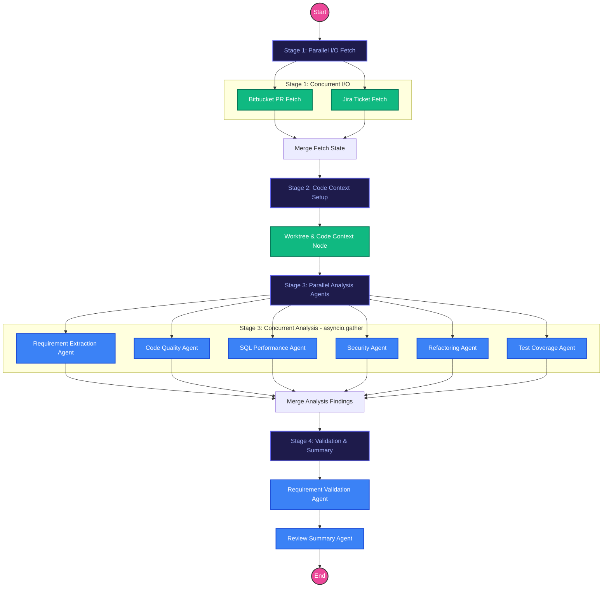

# ReviewAI Backend Workflow & Architecture

This document describes the workflow pipeline, staged parallel execution, local code context integration, Antigravity Language Server RPC bridge, and read-only security guarantees of the ReviewAI backend multi-agent pull request review engine.

---

## Overview

ReviewAI operates as an automated, multi-agent AI code reviewer. It receives a pull request (PR) trigger, gathers metadata from Bitbucket Cloud and Jira Cloud in parallel, prepares an isolated local Git worktree for deep structural code inspection, and executes 6 independent analysis agents concurrently before validating requirement coverage and generating the final review summary.

Orchestration is managed using **LangGraph** combined with `asyncio.gather` for optimal wall-clock performance. The workflow state object (`ReviewState`) accumulates PR diffs, ticket requirements, class metadata, method implementations, findings, and audit logs as it progresses.

---

## Stage-Based Workflow Diagram

---

## Detailed Pipeline Stages

### Stage 1: Parallel I/O Fetch (`_fetch_parallel`)
- **Execution**: Concurrent via `asyncio.gather`.
- **Bitbucket PR Fetch (`pr_fetch`)**:
  - **Security**: Strictly READ-ONLY via `BitbucketReadService`.
  - **Action**: Fetches PR title, description, unified diff, target/source branches, author metadata, and changed file list.
- **Jira Fetch (`jira_fetch`)**:
  - **Security**: Strictly READ-ONLY via `JiraReadService`.
  - **Action**: Auto-detects Jira key from branch name or PR title (`FRES-XXXX`), then retrieves issue summary, description, and acceptance criteria.

### Stage 2: Code Context Setup (`code_context`)
- **Execution**: Sequential setup.
- **Security**: Strictly READ-ONLY via `GitWorktreeManager` and `LocalRepositoryReadService`.
- **Action**:
  - Resolves target repo slug (`fc-angular`, `jsp`, etc.) to local base directory.
  - Prepares an isolated Git worktree checked out at the PR commit.
  - Parses class metadata (package, imports, signatures, annotations) via `JavaCodeParser` / `TypeScriptCodeParser`.
  - Extracts full method implementations on-demand for modified lines.

### Stage 3: Parallel Analysis Agents (`_analyze_parallel`)
- **Execution**: 6 independent analysis agents execute concurrently via `asyncio.gather`.
1. **Requirement Extraction Agent (`requirement_extraction`)**: Uses Jira context to extract structured functional requirements and business rules.
2. **Code Quality Agent (`code_quality`)**: Evaluates SOLID principles, code smells, complexity, and Angular/Spring patterns.
3. **SQL Performance Agent (`sql_performance`)**: Scans for slow queries, missing indexes, `SELECT *`, and N+1 query risks.
4. **Security Agent (`security`)**: Checks OWASP Top 10 vulnerabilities (SQLi, XSS, hardcoded secrets, CSRF, broken access control).
5. **Refactoring Agent (`refactoring`)**: Identifies structural improvements, design patterns, and duplicate reduction.
6. **Test Coverage Agent (`test_coverage`)**: Identifies untested logic and suggests specific unit test scenarios.

### Stage 4: Validation & Summary (`_analyze_sequential`)
- **Execution**: Sequential dependencies.
1. **Requirement Validation Agent (`requirement_validation`)**: Compares PR diff and changed method implementations against requirements extracted in Stage 3 to calculate compliance percentage and flag missing acceptance criteria.
2. **Review Summary Agent (`review_summary`)**: Aggregates, deduplicates, and calculates the overall risk score (0-100), executive summary, and recommendation (`APPROVE` / `NEEDS_DISCUSSION` / `REQUEST_CHANGES`).

---

## LLM Provider Abstraction & Local Antigravity Bridge

ReviewAI supports zero-cost local LLM execution as well as cloud API providers via `LLM_PROVIDER`:

### 1. Local Antigravity RPC Bridge (`LLM_PROVIDER=antigravity`) — Primary Path
- **Endpoint**: `http://127.0.0.1:8899/v1/chat/completions` (OpenAI-compatible protocol).
- **Architecture**: The lightweight Python bridge (`antigravity-bridge`) runs on host network mode (`network_mode: "host"`). It connects directly to the local Antigravity Language Server daemon (`127.0.0.1:PORT`) using Google Connect RPC (`/antigravity.v1.AntigravityService/GetModelResponse`).
- **Authentication**: Leverages the host user's active, authenticated Google OAuth session. **No OAuth tokens or credentials are ever extracted, exported, or saved**.
- **Model**: Default model is `gemini-3.6-flash` (customizable via `ANTIGRAVITY_MODEL`).
- **Fallback Policy**: Controlled by `ALLOW_LLM_FALLBACK=false` to prevent unwanted fallback to public Gemini API keys during development.

### 2. Cloud API Providers (`LLM_PROVIDER=gemini | openai | anthropic`)
- **Gemini**: Directly calls `generativelanguage.googleapis.com` using `GEMINI_API_KEY`.
- **OpenAI**: Calls `api.openai.com` (`gpt-4o`).
- **Anthropic**: Calls `api.anthropic.com` (`claude-3-5-sonnet`).

---

## Read-Only Security Architecture

The ReviewAI analysis engine enforces strict **READ-ONLY** isolation. Any mutation attempt inside the review workflow triggers a `ReadOnlyViolationError`:

1. **BitbucketReadService**: Exposes GET endpoints only. Mutating operations (`post_comment`, `approve_pr`, `merge_pr`) are strictly prohibited during review graph execution.
2. **JiraReadService**: Exposes GET endpoints only. Write operations (`add_comment`, `update_issue`) are blocked.
3. **LocalRepositoryReadService**: Operating inside isolated Git worktrees (`/tmp/reviewai/worktrees/`). Prohibits `git push`, `git commit`, or modifying local working copies.
4. **Publishing Step**: Publishing PR comments or updating Jira tickets occurs as a separate, explicit user action after manual review and approval in the UI.

---

## State Management (`ReviewState`)

The pipeline operates on a typed state dictionary passed across nodes:
- `pr_context`: Diff text, commits, changed files, PR author metadata, and target branch info.
- `jira_context`: Issue summary, description, and acceptance criteria.
- `code_context`: Class structures, AST metadata, and method implementations.
- `requirements`: Extracted business requirements list.
- `findings`: Cumulative list of identified findings.
- `logs`: Audit log entries streamed live to the UI via Server-Sent Events (SSE).
- `progress_percent`: Incremental UI progress percentage (5% to 100%).
